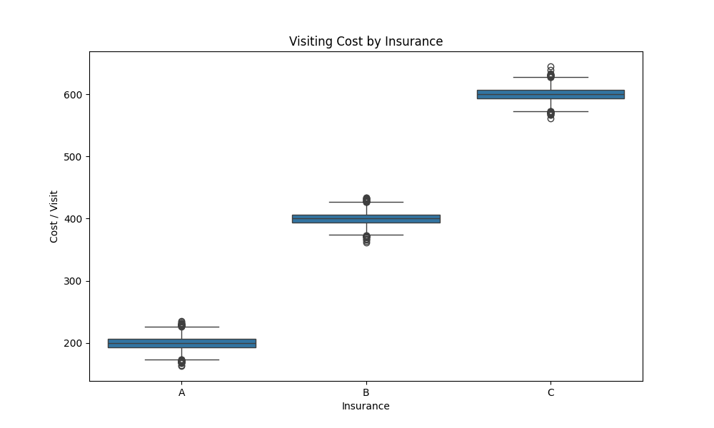
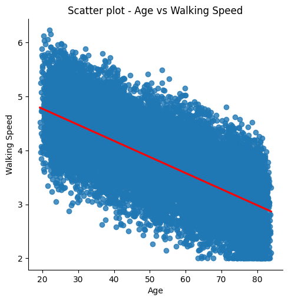
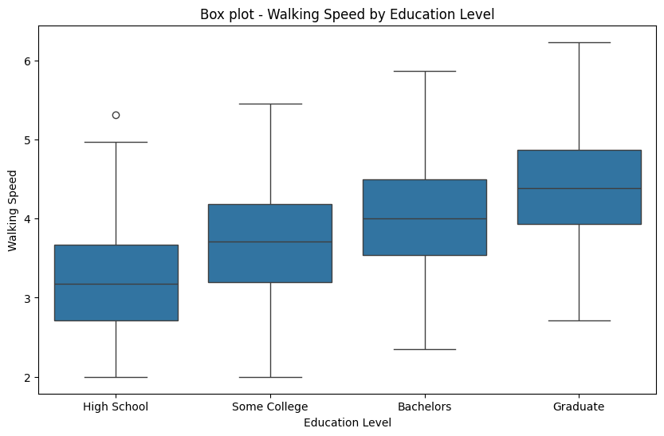
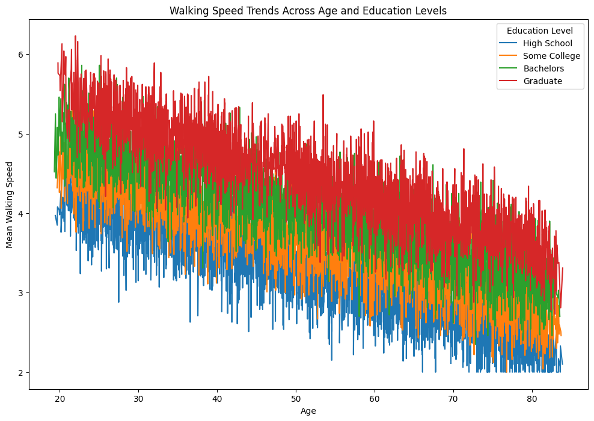
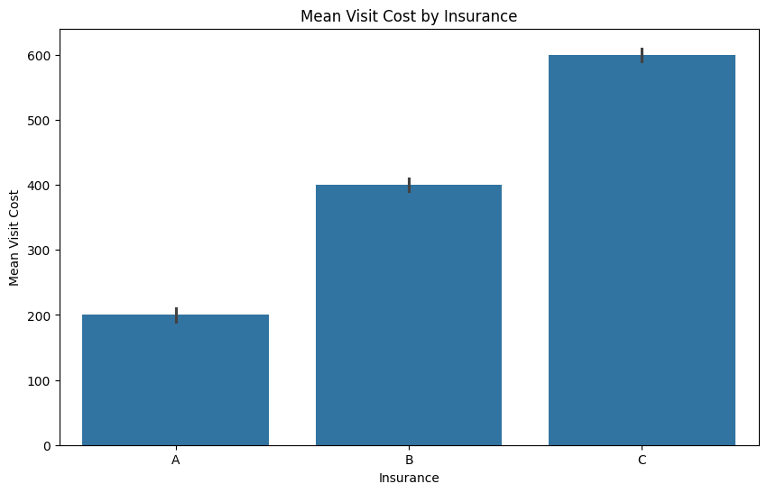
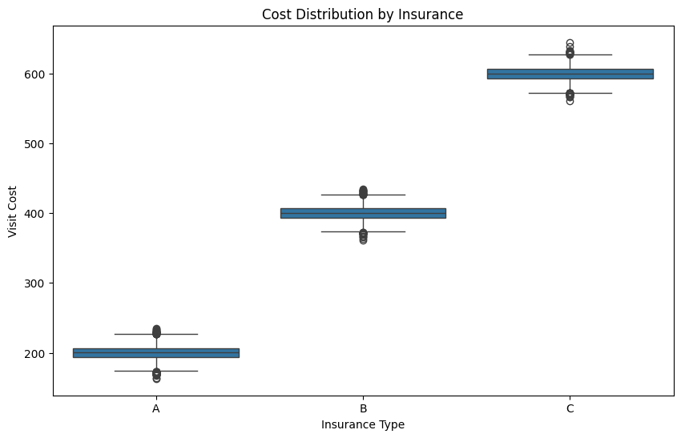
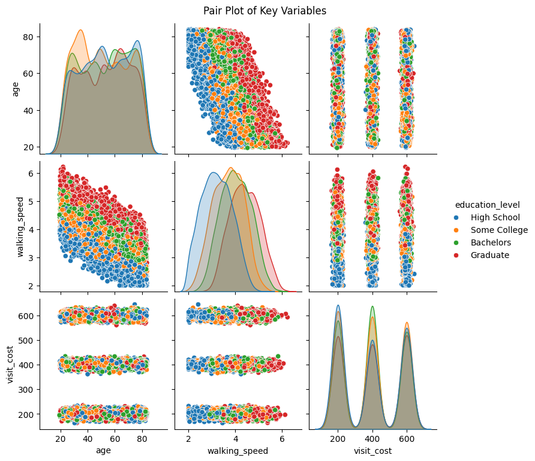
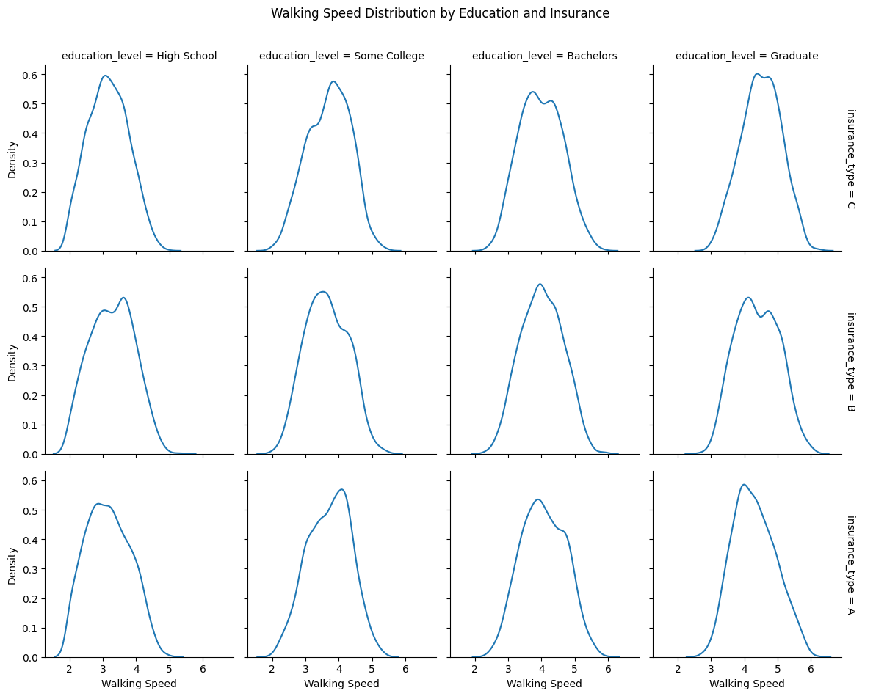
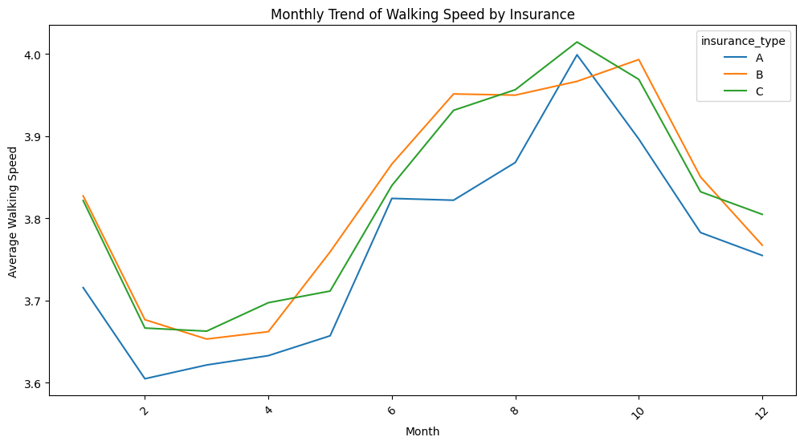

# Summary of the analyses and the results

**Q1: Data Preparation with Command-Line Tools**

- After cleaning the dataset by removing comment lines, empty lines, and extra commas, records within the specific walking speed range (2.0-8.0) were filtered. The cleaned data was saved as `ms_data.csv` with the columns: `patient_id`, `visit_date`, `age`, `education_level`, and `walking_speed`.
- `insurance.lst` contains the types of insurance: `A`, `B`, and `C`.

**Q2: Data Analysis with Python**

- All patients added consistent insurance types across visits using `map()`.
- We checked that there is no outlier using `describe()`.
- The analysis data is saved as `ms_data_combined.csv`

- Consistent insurance types were added across all visits for each patient using `map()`.
- Checked for outliers in the dataset, with no significant outliers detected using `describe()`.
- Summary statistics:

    - **Mean Walking Speed by Education Level**: Higher educational levels are associated with faster mean walking speeds.

    - **Seasonal Trend in Walking Speed**: There appears to be a seasonal pattern in walking speed. From February to June, speeds are relatively lower, while from July to January, speeds are relatively higher.

    - **Correlation between Age and Walking Speed**: The correlation coefficient is -0.69, indicating a negative relationship between age and walking speed.

    - **Mean Visit Costs by Insurance Type**:
        - Insurance A: 200
        - Insurance B: 400
        - Insurance C: 600
 

**Q3: Statistical Analysis**

**Outlier Check**
- Outliers were checked in Q2, with no significant outliers detected.

**Multiple Regression Analysis (Education and Age)**
- All variables (education level and age) were statistically significantly associated with walking speed.
- Higher education levels were associated with faster walking speeds, suggesting that individuals with higher education tend to have better mobility outcomes.
- Age was negatively correlated with walking speed, indicating that as age increases, walking speed tends to decrease.

**Account for Repeated Measures**
- The repeated measures analysis showed similar trends as the previous model, reinforcing the reliability of the findings.

**Trend Analysis**
- **Correlation between Age and Walking Speed**: The correlation coefficient between age and walking speed was -0.69 (p-value: 0.0), indicating a strong inverse relationship. This suggests that as age increases, walking speed significantly decreases.

**Cost Analysis by Insurance Type**
- **Basic Statistics**:
  - Mean and standard deviation of visit costs by insurance type:
  
    | Insurance Type | Mean Cost | Standard Deviation |
    |----------------|-----------|--------------------|
    | A              | 200.09    | 10.02             |
    | B              | 399.98    | 9.96              |
    | C              | 599.95    | 10.16             |

- **Box Plot and Effect Sizes**:
  - Box plot was created to visualize the distribution of visit costs across different insurance types.
  

  - **Effect sizes (Cohen's d)** were calculated for each pair of insurance types, showing significant differences in costs among insurance types A, B, and C:
    - Cohen's d comparing A and B: -20.0
    - Cohen's d comparing A and C: -39.7
    - Cohen's d comparing B and C: -19.9

**Advanced Analysis**

**Interaction Effects: Education Level and Age on Walking Speed**
- **Adjusted Results**: The adjusted coefficients for age and education level were statistically significant, showing the same trends as the non-adjusted model.
- **Interaction Effect**: No statistically significant interaction was found between education levels and age on walking speed. This suggests that the combined effect of education and age does not contribute significantly to variations in walking speed.

**Control for Relevant Confounders**
- **Adjusted Results**: The adjusted coefficients for age and education level remained statistically significant, consistent with previous findings.
- **Interaction between Insurance Type and Visit Cost**: A statistically significant association was found between the interaction of insurance type B and visit cost with walking speed. However, the impact was minimal, with a coefficient of 0.0014 (95% CI: 9.36e-05 - 0.003), suggesting a small effect.

**Q4: Data Visualization**
**Walking speed analysis:**
- **Scatter plot of age vs walking speed with regression line**

- **Box plots by education level**

- **Line plot showing education age interaction**

- **Summary:** 

There are linear trends in age and education levels on walking speed, with higher education levels and younger ages generally associated with faster walking speeds.

### Cost analysis:
- **Bar plot of mean costs by insurance type**

- **Box plots showing cost distributions**

- **Summary:**

Insurance type C has the highest visit costs, while insurance type A has the lowest.

### Combined visualizations:
- **Pair plot of key variables**

- **Faceted plots by education/insurance**

- **Time trends where relevant**

- **Summary:**

Age and education levels are associated with walking speed. There is a seasonal trend in walking speed, with variations observed across different insurance types.